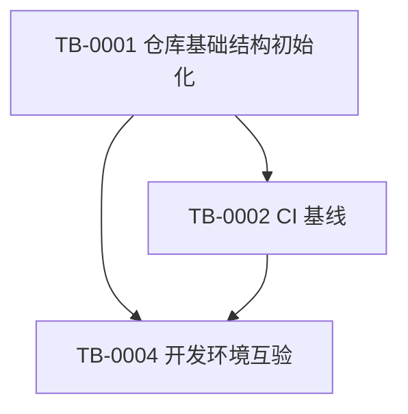

# Trailbook 阶段0并行开发任务书

## 1. 阶段 0 定位

阶段 0 对应《项目架构与并行开发任务书》中的“阶段 0：项目启动与工程基线”。

本阶段只负责建立后续开发所需的工程、产品和环境基础，不实现完整业务功能，也不提前执行阶段 1–5 的任务。

阶段 0 的目标：

- 建立与项目架构一致的 Monorepo 目录和 workspace。
- 固定 Node.js、pnpm、TypeScript 和基础工具版本。
- 建立统一的格式检查、Lint、类型检查、测试和构建入口。
- 建立产品需求基线、原型页面映射和 MVP 验收矩阵。
- 让所有成员能够从全新环境完成安装和基础检查。
- 为阶段 1 的需求、数据和外部服务验证提供明确输入。

建议工期：2–3 个工作日。

阶段 0 完成后，项目才进入阶段 1：

```text
阶段 0：项目启动与工程基线
        ↓
阶段 1：需求与数据验证
        ↓
阶段 2：接口与基础架构
        ↓
阶段 3：核心功能开发
        ↓
阶段 4：端到端联调
        ↓
阶段 5：城市试点与优化
```

---

## 2. 阶段 0 范围边界

### 2.1 本阶段必须完成

- 根目录工程入口。
- `apps`、`packages`、`docs`、`tests`、`scripts`、`infra` 和 `.github` 的基础结构。
- pnpm workspace 识别。
- Node.js 和 pnpm 版本约束。
- ESLint、Prettier、TypeScript 基线。
- `.env.example` 和 `.gitignore`。
- 基础 CI 检查流程。
- 产品 MVP 清单。
- 移动端和 Web 管理端原型页面映射。
- 用户故事和验收条件。
- 多设备安装和基础命令验证。

### 2.2 本阶段不做

以下任务属于阶段 1 或后续阶段，不放入阶段 0：

- 试点城市和真实地点数据验证。
- 地图 SDK、路线服务和天气服务验证。
- 大模型结构化输出验证。
- 内容来源授权和数据合规细化。
- MySQL Schema、Prisma migration 和 Seed。
- API 契约和 API Mock。
- 移动端业务页面开发。
- Web 管理后台业务模块开发。
- 规划引擎开发。
- 完整登录、支付、社交、多人协作和生产部署。

阶段 0 只建立这些后续任务的工程入口和产品输入，不提前实现它们。

---

## 3. 参与角色与阶段职责

| 角色 | 负责人 | 阶段 0 职责 | 阶段 0 交付 |
|---|---|---|---|
| A | 项目统筹与质量验收 | 整理需求、原型、用户故事、验收矩阵和环境互验 | MVP 清单、页面映射、验收矩阵、环境报告 |
| B | 移动端 | 提供移动端目录和运行环境要求，参与原型页面映射和设备验证 | 移动端启动要求、页面映射、设备验证记录 |
| C | Web 管理端 | 提供后台目录和运行环境要求，参与后台模块映射和产品基线 | 后台模块映射、页面状态清单 |
| D | 后端与数据 | 建立 Monorepo、版本规范、基础脚本和 CI 基线 | 工程骨架、workspace、统一脚本、CI |
| E | AI 推荐与规划 | 参与规划相关用户故事、输入输出边界和阶段 1 输入整理 | 规划场景清单、阶段 1 输入约束 |

阶段 0 不要求任何成员完成后端业务、AI 业务或客户端业务功能。

---

## 4. 阶段 0 依赖关系

阶段 0 只包含原架构中的四项任务：

- `TB-0001`：仓库基础结构初始化。
- `TB-0002`：CI 基线（本文件不展开分支与协作规则）。
- `TB-0003`：需求基线与原型页面映射。
- `TB-0004`：开发环境互验。

依赖关系：



并行原则：

- `TB-0001`、`TB-0002` 和 `TB-0003` 可以同时启动。
- `TB-0002` 可以先编写 CI 配置草稿，但正式验证依赖 `TB-0001` 的 workspace 和脚本。
- `TB-0003` 不依赖代码，可以完全并行。
- `TB-0004` 必须等待 `TB-0001` 和 `TB-0002` 的主要交付物完成；`TB-0003` 可以与环境互验并行收尾。

---

## 5. 任务总览

| 架构任务 | 任务名称 | 负责人 | 协作者 | 建议工期 | 前置依赖 |
|---|---|---|---|---:|---|
| TB-0001 | 仓库基础结构初始化 | D | B、C、E | 1 天 | 无 |
| TB-0002 | CI 基线 | A、D | 全体 | 1 天 | 无；正式检查依赖 TB-0001 |
| TB-0003 | 需求基线与原型页面映射 | A | B、C | 1–2 天 | 无 |
| TB-0004 | 开发环境互验 | A | 全体 | 0.5 天 | TB-0001、TB-0002 |

---

## 6. TB-0001 仓库基础结构初始化

负责人：D  
协作者：B、C、E  
建议工期：1 天  
前置依赖：无

### 6.1 工作目标

建立能够支撑后续阶段开发的 Monorepo 和目录入口，不实现业务逻辑。

### 6.2 工作内容

1. 初始化根目录 `package.json`。
2. 初始化 `pnpm-workspace.yaml`。
3. 创建应用目录：

```text
apps/mobile
apps/admin
apps/api
```

4. 创建共享包目录：

```text
packages/contracts
packages/database
packages/planner
packages/providers
packages/ui
packages/config
```

5. 确认文档、测试、脚本和基础设施目录：

```text
docs/product
docs/architecture
docs/api
docs/prototypes
docs/testing
tests/unit
tests/integration
tests/e2e
tests/planner
tests/fixtures
scripts
infra/deployment
.github/workflows
.github/ISSUE_TEMPLATE
```

6. 固定 Node.js、pnpm 和 TypeScript 版本。
7. 配置根目录 TypeScript 基线。
8. 配置 ESLint、Prettier 和 EditorConfig。
9. 创建 `.gitignore`。
10. 创建 `.env.example`，只保留变量名称和示例占位值。
11. 提供基础命令入口：

```text
pnpm install
pnpm dev
pnpm test
pnpm lint
pnpm typecheck
pnpm build
```

12. 为各 workspace 预留独立的 `package.json`，但可以暂时只有最小脚本。
13. 将开发环境安装说明放入：

```text
docs/architecture/development-environment-setup.md
```

### 6.3 交付物

- 根目录 `package.json`。
- `pnpm-workspace.yaml`。
- Node.js 和 pnpm 版本约束文件。
- Monorepo 目录结构。
- TypeScript、ESLint、Prettier 和 EditorConfig 配置。
- `.gitignore`。
- `.env.example`。
- 基础开发命令。
- 开发环境说明。

### 6.4 验收标准

- 五名成员可以安装统一版本的依赖。
- `pnpm install` 可以识别全部 workspace。
- 根目录命令可以被正确解析。
- 不存在 npm、yarn 和 pnpm 混用产生的多份锁文件。
- 目录结构与项目架构文档一致。
- `.env.example` 不包含真实密钥。
- 业务代码尚未实现时，基础工程仍可以完成安装和静态检查。

---

## 7. TB-0002 CI 基线

负责人：A、D  
协作者：全体  
建议工期：1 天  
前置依赖：无；正式检查依赖 TB-0001

### 7.1 工作目标

建立自动化质量检查入口，使后续阶段的代码能够在统一环境中完成基础验证。

### 7.2 工作内容

1. 创建 GitHub Actions 工作流。
2. 配置 Node.js 和 pnpm 版本。
3. 使用锁文件安装依赖。
4. 执行以下检查：

```text
pnpm install --frozen-lockfile
pnpm format:check
pnpm lint
pnpm typecheck
pnpm test
pnpm build
```

5. 确认格式、Lint、类型、测试和构建任一失败时能够明确显示失败原因。
6. 确认 CI 不依赖开发者本地绝对路径。
7. 确认 CI 不依赖真实 API Key。
8. 确认数据库相关测试不强制依赖开发者本机数据库。
9. 为后续集成测试预留 MySQL 服务或测试容器配置位置。
10. 检查仓库中不存在真实密钥、用户数据和未经授权的内容。
11. 检查数据库 Schema 变更必须能够附带 migration。

### 7.3 交付物

- GitHub Actions 工作流。
- CI 检查命令说明。
- CI 失败处理说明。
- 测试和构建入口说明。

### 7.4 验收标准

- 提交代码后能够自动运行 CI。
- CI 能识别全部 workspace。
- 格式、Lint、类型、测试和构建命令均有执行结果。
- 检查失败时不会被误判为通过。
- CI 不依赖个人路径、个人 IDE 配置或真实密钥。
- 在业务代码为空或只有骨架时，基础检查仍可执行。

---

## 8. TB-0003 需求基线与原型页面映射

负责人：A  
协作者：B、C  
建议工期：1–2 天  
前置依赖：无

### 8.1 工作目标

把产品计划书和现有原型转化为后续开发可以直接使用的用户故事、页面清单和验收条件。

### 8.2 工作内容

1. 将产品计划书中的 MVP 功能转换为用户故事。
2. 整理移动端九类页面：

```text
首页
创建计划
生成状态
行程
地图
地点详情
调整行程
发现
我的
```

3. 整理 Web 管理后台八个模块：

```text
运营总览
用户行程
攻略来源审核
地点与美食库
路线方案
AI 推荐规则
数据分析
服务与设置
```

4. 建立页面、用户故事、接口和验收条件之间的映射。
5. 标记原型中的字段：

```text
真实业务字段
演示字段
待确认字段
暂缓字段
```

6. 标记加载、空数据、错误、无网络和权限失败状态。
7. 明确阶段 1 需要确认的试点城市、用户类型和核心场景。
8. 明确 MVP 不包含的功能。
9. 准备晚到、完整日、返程日、雨天、少走路和饮食限制场景的验收输入。
10. 标注原型中的演示数据，防止被误认为真实数据。

### 8.3 交付物

- MVP 功能清单。
- 用户故事清单。
- 移动端页面映射表。
- Web 管理后台模块映射表。
- 页面状态清单。
- MVP 验收矩阵。
- 阶段 1 待确认事项清单。
- 暂缓功能清单。

### 8.4 验收标准

- 每个 MVP 功能都有用户故事和验收条件。
- 每个页面都能追溯到用户目标或运营目标。
- 移动端九类页面均有映射。
- 后台八个模块均有映射。
- 页面包含正常、加载、空数据和错误状态。
- 原型演示内容已经明确标记。
- 阶段 1 的输入、输出和不做事项没有歧义。
- B、C、D、E 可以依据文档开始下一阶段工作。

---

## 9. TB-0004 开发环境互验

负责人：A  
协作者：全体  
建议工期：0.5 天  
前置依赖：TB-0001、TB-0002

### 9.1 工作目标

确认项目可以在不同成员、不同设备和不同操作系统上从零开始安装和执行基础检查。

### 9.2 工作内容

1. 每位成员使用全新终端环境执行安装。
2. 按开发环境文档检查：

```text
Git
Node.js 24 LTS
pnpm
Docker Desktop
Docker Compose
Android Studio（移动端成员）
Chrome 或 Edge
```

3. 执行根目录基础命令：

```text
pnpm install
pnpm lint
pnpm typecheck
pnpm test
pnpm build
```

4. 检查目录、workspace、环境模板和启动入口。
5. 至少覆盖两种操作系统，建议 Windows + macOS 或 Windows + Linux。
6. 记录端口冲突、权限、路径、Android SDK 和 Docker 差异。
7. 记录每个问题的原因、解决方式和后续负责人。
8. 确认不存在依赖个人绝对路径或个人密钥的步骤。

### 9.3 交付物

- 环境互验记录。
- 安装和检查日志。
- 常见问题清单。
- 操作系统差异记录。
- 未解决问题清单。
- 阶段 1 输入确认记录。

### 9.4 验收标准

- 至少两台不同设备可以从零安装。
- 五名成员可以完成基础命令检查，或明确记录未完成原因。
- 根目录 workspace 可以被识别。
- 格式、Lint、类型检查、测试和构建入口可执行。
- 文档没有依赖个人绝对路径。
- 文档没有要求真实 API Key 才能完成阶段 0。
- 所有阻塞问题都有负责人和处理期限。

---

## 10. 阶段 0 执行安排

### 第 1 天：工程骨架、需求和 CI 同时启动

| 角色 | 上午 | 下午 | 当日结果 |
|---|---|---|---|
| A | 整理 MVP 范围和用户故事 | 编写验收矩阵 | 需求基线初稿 |
| B | 提供移动端页面和设备要求 | 参与移动端原型映射 | 移动端页面映射初稿 |
| C | 提供后台模块和页面状态 | 参与后台原型映射 | 后台模块映射初稿 |
| D | 初始化 Monorepo 和目录 | 配置版本、脚本和格式工具 | 工程骨架初版 |
| E | 梳理规划相关用户故事 | 整理阶段 1 输入约束 | 规划场景清单 |

### 第 2 天：完成工程基线和需求基线

| 角色 | 上午 | 下午 | 当日结果 |
|---|---|---|---|
| A | 完成用户故事和 MVP 清单 | 完成验收矩阵 | 需求基线完成 |
| B | 检查移动端启动前置条件 | 补充页面状态和错误状态 | 移动端映射完成 |
| C | 检查后台页面和模块边界 | 补充表格、筛选和权限状态 | 后台映射完成 |
| D | 完成统一脚本和环境模板 | 完成 CI 工作流 | 工程和 CI 基线完成 |
| E | 补充晚到、雨天、返程场景 | 评审规划输入输出边界 | 阶段 1 输入完成 |

### 第 3 天：环境互验和阶段 0 验收

| 角色 | 上午 | 下午 | 当日结果 |
|---|---|---|---|
| A | 组织全员环境互验 | 汇总问题和验收证据 | 阶段 0 验收报告 |
| B | Android 环境和基础命令检查 | 提交设备验证记录 | 移动端环境记录 |
| C | Web 工程和浏览器检查 | 提交页面映射记录 | 后台环境记录 |
| D | 修复安装、脚本和 CI 问题 | 确认根目录命令 | 工程基线稳定 |
| E | 验证规划资料可追溯 | 提交阶段 1 输入清单 | 规划输入记录 |

如果第 3 天仍有环境问题，不进入阶段 1 的正式开发；必须先记录问题、负责人、影响范围和预计解决时间。TB-0003 的需求基线可以在环境互验期间继续完成，但必须在阶段 0 关闭前提交。

---

## 11. 阶段 0 完成定义

阶段 0 只有同时满足以下条件才能关闭：

1. TB-0001、TB-0002、TB-0003、TB-0004 均有交付物。
2. 根目录可以识别全部 workspace。
3. Node.js、pnpm、TypeScript 和基础工具版本已经固定。
4. `pnpm install`、`pnpm lint`、`pnpm typecheck`、`pnpm test` 和 `pnpm build` 入口已经定义。
5. CI 可以执行基础检查。
6. 产品 MVP 清单已经冻结。
7. 移动端九类页面完成映射。
8. Web 管理后台八个模块完成映射。
9. 用户故事、验收条件和暂缓事项已经记录。
10. 至少两台不同设备完成从零安装和基础验证。
11. 没有真实密钥、个人绝对路径或未经授权数据进入仓库。
12. 所有阻塞问题都有明确负责人和处理期限。
13. 已形成阶段 1 的输入、风险和待确认事项清单。

---

## 12. 阶段 0 风险与应对

| 风险 | 预警信号 | 应对方式 | 责任人 |
|---|---|---|---|
| Monorepo 初始化不完整 | workspace 无法识别 | 由 D 统一维护根配置，其他成员只提交子目录配置 | D |
| Node 或 pnpm 版本不一致 | 安装结果不同 | 固定版本文件和 packageManager 字段 | D |
| CI 依赖业务代码 | 空骨架无法通过检查 | 阶段 0 使用最小可执行脚本和占位测试 | D |
| 移动端环境差异 | Android SDK 或 Expo 无法启动 | 记录设备差异，先完成基础工程检查 | B、D |
| 原型范围扩大 | 不断增加页面和功能 | A 维护 MVP 和暂缓清单 | A |
| 需求字段不一致 | 客户端和后台各自解释字段 | 阶段 0 记录字段边界，阶段 2 由共享契约冻结 | A、D、E |
| 阶段 0 与阶段 1 混淆 | 提前开发地图、天气或 AI | 将相关内容只记录为阶段 1 输入，不提前实现 | A |
| 当前仓库缺少工程入口 | 没有 package.json 或 workspace 配置 | TB-0001 先完成实际工程文件，再执行 TB-0004 | D |

---

## 13. 阶段 0 交付清单

阶段 0 验收前，仓库应至少包含：

```text
README.md
.nvmrc
package.json
pnpm-workspace.yaml
.env.example
.gitignore

apps/
apps/mobile/
apps/admin/
apps/api/

packages/
packages/contracts/
packages/database/
packages/planner/
packages/providers/
packages/ui/
packages/config/

docs/product/
docs/architecture/
docs/api/
docs/prototypes/
docs/testing/

tests/
scripts/
infra/
.github/
```

阶段 0 不要求出现以下文件：

```text
packages/database/prisma/schema.prisma
packages/database/prisma/migrations/
compose.yaml
API 路由实现
移动端业务页面实现
Web 后台业务模块实现
规划引擎实现
```

这些文件分别在阶段 1 或阶段 2 的任务中产生。

---

## 14. 可行性验证

### 14.1 与项目架构一致性

阶段 0 完整对应原架构中的四项任务：

| 本文任务 | 项目架构任务 | 是否一致 |
|---|---|---|
| TB-0001 仓库基础结构初始化 | TB-0001 | 是 |
| TB-0002 CI 基线 | TB-0002 | 是，保留 CI 内容 |
| TB-0003 需求基线与原型页面映射 | TB-0003 | 是 |
| TB-0004 开发环境互验 | TB-0004 | 是 |

阶段 0 没有混入 TB-0101 至 TB-0106 或 TB-0201 至 TB-0206。

### 14.2 并行可行性

- D 负责 TB-0001，同时 A、D 可以准备 TB-0002 的 CI 配置。
- A、B、C、E 可以独立完成 TB-0003 的需求和原型整理。
- TB-0004 等待工程和 CI 基线完成；TB-0003 与其并行收尾，依赖关系清晰。
- 没有循环依赖。
- D 是阶段 0 的主要工程瓶颈，需要优先完成 TB-0001。

### 14.3 工期可行性

原架构给出的工期为：

- TB-0001：1 天。
- TB-0002：1 天。
- TB-0003：1–2 天。
- TB-0004：0.5 天。

因为 TB-0001、TB-0002 和 TB-0003 可以部分并行，所以阶段 0 总工期控制在 2–3 个工作日是可行的。

如果当前仓库从零创建真实 `package.json`、workspace、CI 和跨平台脚本，建议按 3 天执行；如果还要同时处理 Android SDK、Docker 权限或团队设备差异，应预留额外 0.5–1 天。

### 14.4 当前仓库落地条件

当前仓库已经具备：

- 计划书。
- 架构与并行开发任务书。
- 原型文件。
- 文档目录。
- 按架构创建的目录骨架。

当前仓库仍需要通过 TB-0001 实际创建或确认：

- 根目录 `package.json`。
- `pnpm-workspace.yaml`。
- `.nvmrc`。
- `.env.example`。
- `.gitignore`。
- 各 workspace 的 `package.json`。
- CI 工作流。
- 统一脚本。

因此，本阶段 0 任务书可执行，但当前仓库还处于“目录和文档准备完成、工程入口待初始化”的状态。

### 14.5 阶段 0 结论

阶段 0 任务拆分、依赖关系、角色分工和 2–3 天工期均可行。

阶段 0 关闭后，阶段 1 可以按照总架构任务书继续执行：

```text
阶段 0 完成
→ TB-0101 试点城市与场景冻结
→ TB-0102 地图验证
→ TB-0103 天气验证
→ TB-0104 大模型验证
→ TB-0105 内容合规
→ TB-0106 核心数据字典
```
